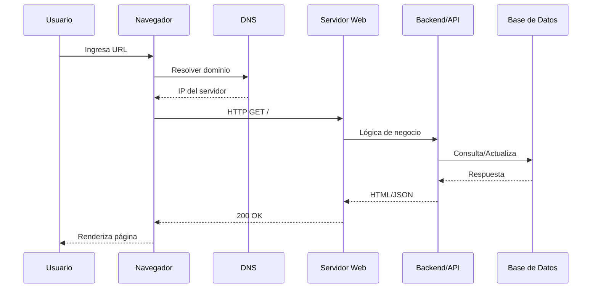
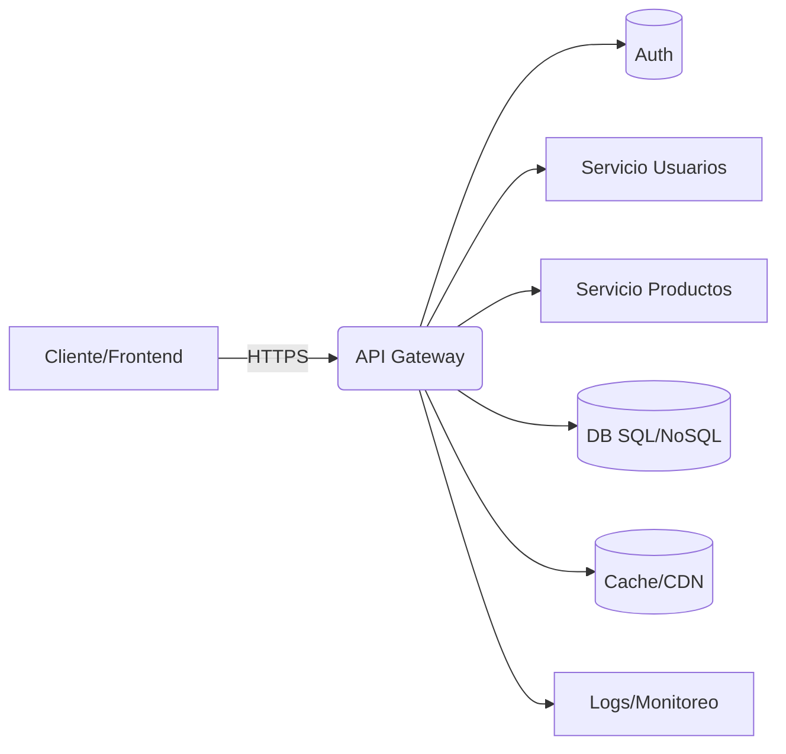

<!-- ENCABEZADO animado con ola -->

  

<!-- Título con "typing" -->

  

  
  
  
  

---

## 🧭 Índice
- [Introducción](#introducción)
- [Temas aprendidos](#temas-aprendidos)
- [Ejercicios de laboratorio y evidencias](#ejercicios-de-laboratorio-y-evidencias)
- [Tablas de referencia](#tablas-de-referencia)
- [Diagramas (Mermaid)](#diagramas-mermaid)
- [Reflexión y próximos pasos](#reflexión-y-próximos-pasos)
- [Bibliografía y enlaces](#bibliografía-y-enlaces)

---

  

### Introducción
Durante esta semana consolidé **fundamentos de la Web** (HTTP/HTTPS, HTML, CSS, JavaScript y Web APIs), la **arquitectura cliente-servidor**, el **rol de DNS**, y la diferencia entre **frontend** y **backend**. Además, estructuré mi **portafolio en GitHub Pages** para documentar el aprendizaje de forma continua y verificable.

> **Objetivo personal:** publicar cada semana un bloque breve de teoría, prácticas reproducibles y una reflexión metacognitiva.

---

  

### Temas aprendidos
**Resumen corto**  
> _La Web funciona con estándares abiertos. Un navegador (cliente) solicita recursos a un servidor usando HTTP/HTTPS. HTML estructura, CSS presenta, JS agrega interacción mediante Web APIs. DNS traduce dominios a IPs._

**Puntos clave**
- 🧩 **Ecosistema base:** HTTP, HTML, CSS, JS, Web APIs, DNS.
- 🧭 **Open Web Platform:** estándares de WHATWG/W3C/IETF/ECMA.
- 📦 **Frontend vs Backend:** interfaz vs. lógica/datos; CSR/SSR/SSG.
- 🛡️ **Buenas prácticas iniciales:** accesibilidad (WAI-ARIA), rendimiento (LCP/CLS/TTFB), control de versiones (Git).

**Errores comunes y prevención**
- ❌ Mezclar estructura y estilo en HTML → ✅ separar responsabilidades (HTML semántico + CSS).
- ❌ No versionar cambios → ✅ `git add/commit/push` frecuentes y mensajes descriptivos.
- ❌ Ignorar DNS/hosting → ✅ comprender A/AAAA/CNAME y usar GitHub Pages correctamente.

---

  

### Ejercicios de laboratorio y evidencias
**Qué se hizo**
- [ ] **Lab 01 — VS Code**: interfaz, paleta de comandos y terminal integrada → **Resultado:** _configuración base guardada_.
- [ ] **Git básico**: `init`, `add`, `commit`, `branch`, `push` → **Resultado:** _repo y primer commit en remoto_.
- [ ] **GitHub Pages**: activar y publicar → **Resultado:** _sitio accesible públicamente_.
- [ ] **Emmet**: atajos para esqueleto HTML → **Resultado:** _productividad + rapidez_.

**Capturas (coloca tus imágenes)**

  

<em>Figura 1. VS Code con extensiones y terminal.</em>

  

<em>Figura 2. Sitio publicado en GitHub Pages.</em>

---

  

### Tablas de referencia
**Estándares y recursos**
| Área | Recurso | Descripción | Enlace |
|---|---|---|---|
| Protocolo | HTTP/HTTPS | Transporte de documentos hipermedia | https://httpwg.org/specs/ |
| Marcado | HTML (WHATWG) | Estructura semántica | https://html.spec.whatwg.org/ |
| Estilos | CSS (W3C) | Presentación y layout | https://www.w3.org/Style/CSS/Overview.en.html |
| APIs | Web APIs (MDN) | DOM, Fetch, Storage, etc. | https://developer.mozilla.org/en-US/docs/Web/API |
| Gráficos | SVG / WebGL | Vectorial y 3D en `<canvas>` | https://developer.mozilla.org/en-US/docs/Web/API/WebGL_API/Tutorial |
| Accesibilidad | WAI-ARIA | Roles/props accesibles | https://www.w3.org/TR/html-aria/ |

**Frontend vs Backend**
| Aspecto | Frontend | Backend |
|---|---|---|
| Lenguajes | HTML, CSS, JS/TS | Python, Node.js, Java, PHP |
| Frameworks | React, Vue, Angular | Django, Express, Spring, Laravel |
| Foco | UX, accesibilidad, performance | Seguridad, escalado, datos |
| Entrega | CSR/SSR/SSG, CDN | APIs, microservicios, colas |

**Checklist Lab 01**
| Ítem | Hecho | Nota |
|---|:--:|---|
| Instalar ESLint/Prettier/Live Server | ☐ |  |
| Configurar “format on save” | ☐ |  |
| Crear repo y primer commit | ☐ |  |
| Activar GitHub Pages | ☐ |  |
| Documentar evidencias | ☐ |  |

---

  

### Diagramas (Mermaid)

**Flujo de petición web**

**Arquitectura (alto nivel)**

---

  

### Reflexión y próximos pasos
**¿Qué aprendí?**  
> _La Web es un ecosistema de **estándares**; entender DNS/HTTP y separar frontend/backend me permite diagnosticar y construir mejor._

**¿Cómo lo aprendí?**  
> _Práctica dirigida en VS Code, lectura de especificaciones, publicación en GitHub Pages y revisión de documentación (MDN/WHATWG/W3C)._

**Aplicación inmediata**
- 🔗 Publicar una **página accesible** (semántica + roles ARIA).
- 🚀 Implementar **SSR/SSG** en un ejemplo con rutas simples.
- 📈 Medir LCP/CLS y optimizar imágenes.

---

  

- WHATWG · HTML Living Standard — https://html.spec.whatwg.org/
- W3C · CSS Overview — https://www.w3.org/Style/CSS/Overview.en.html
- HTTPWG · Especificaciones — https://httpwg.org/specs/
- MDN · Web APIs — https://developer.mozilla.org/en-US/docs/Web/API
- Cloudflare · ¿Qué es DNS? — https://www.cloudflare.com/learning/dns/what-is-dns/
- Emmet · Cheat Sheet — https://docs.emmet.io/cheat-sheet/
- GitHub Pages · Quickstart — https://docs.github.com/en/pages/quickstart

---

<!-- PIE con ola -->

  

