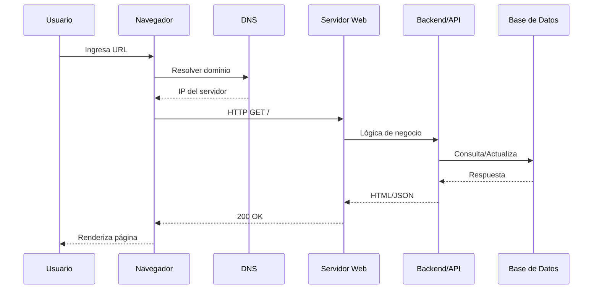
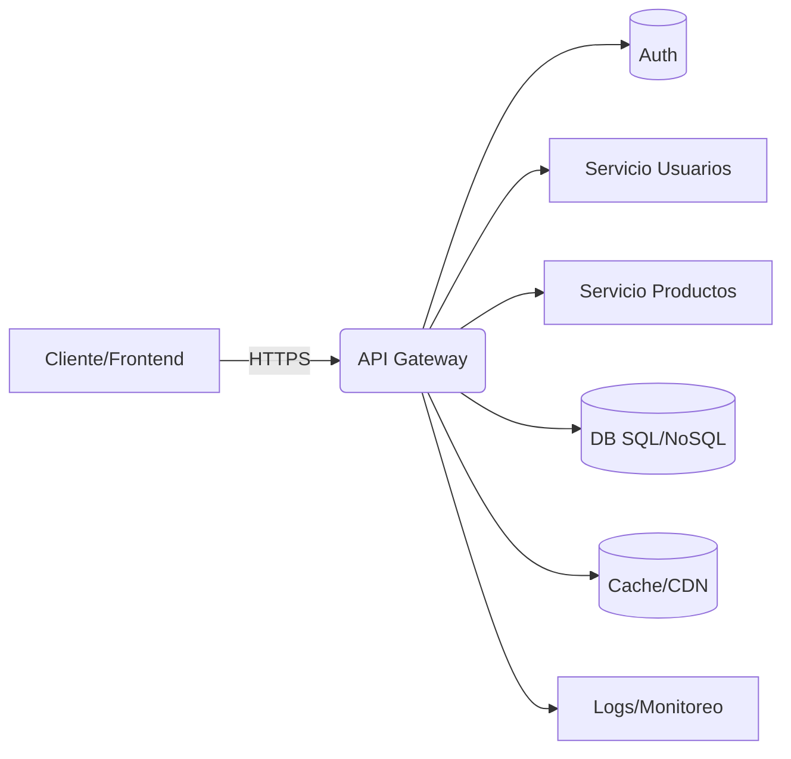

<!-- Encabezado animado en tonos pastel (sin 'cuaderno digital') -->

  

<!-- Título con efecto 'typing' -->

  

  
  
  

---

## 🧭 Índice
- [Resumen breve](#resumen-breve)
- [Temas aprendidos](#temas-aprendidos)
- [Laboratorio y evidencias (imágenes de internet)](#laboratorio-y-evidencias-im%C3%A1genes-de-internet)
- [Tablas rápidas](#tablas-r%C3%A1pidas)
- [Diagramas Mermaid](#diagramas-mermaid)
- [Reflexión](#reflexi%C3%B3n)
- [Bibliografía](#bibliograf%C3%ADa)

---

## Resumen breve
> Semana 01. Entendí **cómo funciona la Web** y por qué los **estándares abiertos** (HTTP, HTML, CSS, JavaScript y Web APIs) permiten que cualquier navegador y servidor se entiendan. A nivel de infraestructura, repasé **DNS** y la **arquitectura cliente‑servidor**. Organicé mi **portafolio en GitHub Pages** para evidenciar prácticas y reflexiones.

---

## Temas aprendidos
- **Ecosistema base:** HTTP/HTTPS, HTML, CSS, JS y Web APIs.  
- **Open Web Platform:** principios de independencia, transparencia y documentación abierta.  
- **DNS:** traduce dominios (ej. `www.uncp.edu.pe`) a direcciones IP.  
- **Frontend vs Backend:** interfaz/experiencia vs. lógica/datos/seguridad.  
- **Herramientas:** Visual Studio Code, Git, GitHub Pages, Emmet, Codespaces.  

**Errores que evité**
- Mezclar estructura y estilos → separé HTML semántico y presentación.  
- No versionar cambios → usé `git add/commit/push` con mensajes claros.  
- No documentar → registré evidencias en el portafolio.

---

## Laboratorio y evidencias (imágenes de internet)
> Coloco referencias visuales **de internet** (no locales) que representan lo trabajado.

**Figura 1. Arquitectura cliente‑servidor**  

**Figura 2. Diagrama DNS**  

**Figura 3. Visual Studio Code — Interfaz**  

**Figura 4. GitHub Pages — Panel de ayuda**  

---

## Tablas rápidas

**Estándares y recursos**
| Área | Recurso | Descripción | Enlace |
|---|---|---|---|
| Protocolo | HTTP/HTTPS | Transporte de documentos hipermedia | https://httpwg.org/specs/ |
| Marcado | HTML (WHATWG) | Estructura semántica | https://html.spec.whatwg.org/ |
| Estilos | CSS (W3C) | Presentación y layout | https://www.w3.org/Style/CSS/Overview.en.html |
| APIs | Web APIs (MDN) | DOM, Fetch, Storage, etc. | https://developer.mozilla.org/en-US/docs/Web/API |
| Gráficos | WebGL (MDN) | 3D con `<canvas>` | https://developer.mozilla.org/en-US/docs/Web/API/WebGL_API/Tutorial |
| Accesibilidad | WAI‑ARIA | Roles/props accesibles | https://www.w3.org/TR/html-aria/ |

**Frontend vs Backend**
| Aspecto | Frontend | Backend |
|---|---|---|
| Lenguajes | HTML, CSS, JS/TS | Python, Node.js, Java, PHP |
| Frameworks | React, Vue, Angular | Django, Express, Spring, Laravel |
| Foco | UX, accesibilidad, rendimiento | Seguridad, escalado, datos |
| Entrega | CSR/SSR/SSG, CDN | APIs, microservicios, colas |

**Checklist Lab 01**
| Ítem | Hecho | Nota |
|---|:--:|---|
| Configuré VS Code y extensiones | ☐ |  |
| Probé Emmet y snippets | ☐ |  |
| Repo creado + primer commit | ☐ |  |
| Activé GitHub Pages | ☐ |  |
| Registré evidencias | ☐ |  |

---

## Diagramas Mermaid

**Flujo de petición web**

**Arquitectura (alto nivel)**

---

## Reflexión
> Aprendí a **fundamentar** lo que hago: estándares, DNS, cliente/servidor y control de versiones. Publicar en **GitHub Pages** me obligó a documentar y a cuidar accesibilidad y rendimiento desde el inicio. Para la siguiente semana, reforzaré **ARIA** y mediré **LCP/CLS** para mejorar tiempos y estabilidad visual.

---

## Bibliografía
- WHATWG · HTML Living Standard — https://html.spec.whatwg.org/  
- W3C · CSS Overview — https://www.w3.org/Style/CSS/Overview.en.html  
- HTTPWG · Especificaciones — https://httpwg.org/specs/  
- MDN · Web APIs — https://developer.mozilla.org/en-US/docs/Web/API  
- Cloudflare · ¿Qué es DNS? — https://www.cloudflare.com/learning/dns/what-is-dns/  
- Emmet · Cheat Sheet — https://docs.emmet.io/cheat-sheet/  
- GitHub Pages · Quickstart — https://docs.github.com/en/pages/quickstart

<!-- Pie animado pastel -->

  

