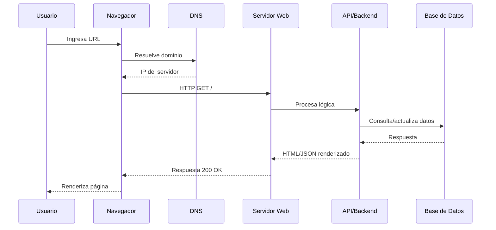
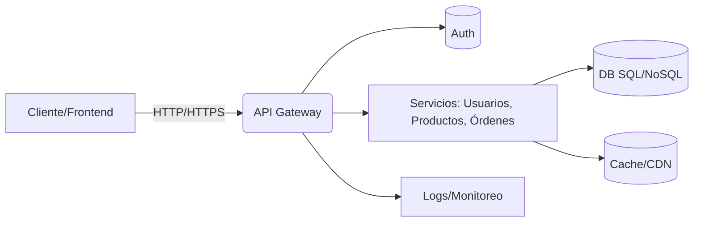

<!--
  Semana 01 – Informe con decorado, animación ligera y recursos visuales
  NOTA: Este archivo es Markdown con HTML/CSS embebido para usarse en GitHub Pages o cualquier visor que permita HTML en Markdown.
  - No requiere JavaScript. Animaciones hechas solo con CSS/SVG.
  - En GitHub.com y GitHub Pages también se renderizan los diagramas Mermaid.
-->

<style>
:root{
  --bg:#0b1020; --ink:#eaf1ff; --muted:#9fb0d0; --accent:#7c3aed; --accent2:#22d3ee; --ok:#10b981; --warn:#f59e0b; --err:#ef4444;
  --card:#11162a; --line:#1f2842; --glow:0 10px 30px rgba(124,58,237,.25);
  --radius:16px; --radius-sm:10px; --shadow:0 1px 2px rgba(0,0,0,.12), 0 12px 40px rgba(0,0,0,.35);
  --mono: ui-monospace, SFMono-Regular, Menlo, Consolas, "Liberation Mono", monospace;
  --sans: Inter, ui-sans-serif, system-ui, Segoe UI, Roboto, Helvetica, Arial;
}
html,body{background:var(--bg); color:var(--ink); font-family:var(--sans);}
.md-container{max-width:1080px; margin:28px auto; padding:0 18px;}
.badge{display:inline-block; padding:6px 10px; border-radius:999px; background:linear-gradient(90deg,var(--accent),var(--accent2)); color:white; font-weight:600; letter-spacing:.3px;}
.cover{position:relative; border-radius:var(--radius); padding:28px; background: radial-gradient(1000px 500px at 10% -10%, rgba(124,58,237,.35), transparent 50%),
         radial-gradient(800px 400px at 90% 10%, rgba(34,211,238,.25), transparent 50%),
         linear-gradient(180deg, #0b1020, #0e1530);
         box-shadow:var(--shadow); overflow:hidden}
.cover h1{font-size:36px; line-height:1.15; margin:0 0 6px;}
.cover p{color:var(--muted); margin:6px 0 0}
.glow{box-shadow:var(--glow)}
.hr{height:1px; background:linear-gradient(90deg,transparent, #3a3f6b, transparent); margin:20px 0}

/* Animated accent bar */
.accent-bar{height:6px; border-radius:999px; background: linear-gradient(90deg,var(--accent),var(--accent2));
  background-size:200% 100%; animation: slide 4s linear infinite; margin:10px 0 24px}
@keyframes slide{0%{background-position:0 0}100%{background-position:200% 0}}

.card{background:linear-gradient(180deg,#101633,#0b1127); border:1px solid var(--line); border-radius:var(--radius); padding:18px; box-shadow:var(--shadow)}
.grid{display:grid; gap:14px}
.grid-2{grid-template-columns:repeat(2,minmax(0,1fr))}
.grid-3{grid-template-columns:repeat(3,minmax(0,1fr))}
@media (max-width:900px){.grid-2,.grid-3{grid-template-columns:1fr}}
.caption{color:var(--muted); font-size:13px; margin-top:6px}
.figure{border:1px solid var(--line); border-radius:var(--radius-sm); overflow:hidden}
.figure img{display:block; width:100%; height:auto}
.kbd{font-family:var(--mono); background:#0b1228; border:1px solid #2b2f55; padding:2px 6px; border-radius:6px}
.toc{background:linear-gradient(180deg,#0c1433,#0a1026); border:1px solid var(--line); border-radius:var(--radius); padding:16px}
.tip{border-left:4px solid var(--ok); background:#0c1b18; padding:10px 12px; border-radius:8px}
.warn{border-left:4px solid var(--warn); background:#211a07; padding:10px 12px; border-radius:8px}
.note{border-left:4px solid var(--accent2); background:#0b1620; padding:10px 12px; border-radius:8px}
.table{width:100%; border-collapse:separate; border-spacing:0; overflow:hidden; border-radius:12px; border:1px solid var(--line)}
.table th,.table td{padding:10px 12px; border-bottom:1px solid var(--line)}
.table th{background:#0f1736; text-align:left}
.table tr:last-child td{border-bottom:none}

/* Small pulse for list markers */
ol li::marker, ul li::marker{color:var(--accent2)}
.pulse{position:relative}
.pulse::after{content:""; position:absolute; left:-16px; top:8px; width:8px; height:8px; background:var(--accent2); border-radius:999px; filter:blur(.5px); animation:pulse 2.5s ease-in-out infinite}
@keyframes pulse{0%{transform:scale(.7); opacity:.7}50%{transform:scale(1.2); opacity:1}100%{transform:scale(.7); opacity:.7}}

blockquote{border-left:3px solid #334; padding:6px 12px; margin:12px 0; color:#c8d4ff; background:#0c1230; border-radius:10px}

.fig-row{display:flex; gap:12px; flex-wrap:wrap}
.fig-row .figure{flex:1 1 280px}

.small{font-size:13px; color:var(--muted)}
</style>

<div class="md-container">

<div class="cover glow">
  <span class="badge">IS093 – Desarrollo de Aplicaciones Web</span>
  <h1>Informe Semana 01 · Fundamentos de la Tecnología Web</h1>
  <p>Universidad Nacional del Centro del Perú · Facultad de Ingeniería de Sistemas</p>
  <div class="accent-bar"></div>
  <div class="grid grid-2">
    <div class="card">
      <b>Docente:</b> Mg. Jaime Suasnábar Terrel<br>
      <b>Estudiante:</b> <i>Coloca tu nombre</i><br>
      <b>Fecha:</b> <span>Semana 01</span>
    </div>
    <div class="card">
      <b>Entregable:</b> Informe + Portafolio (GitHub Pages)<br>
      <b>Formato:</b> Markdown enriquecido (imágenes, diagramas, tablas)
    </div>
  </div>
</div>


## Índice
<div class="toc">
<ol>
<li><a href="#introduccion">Introducción</a></li>
<li><a href="#requisitos">Requisitos y recursos tecnológicos</a></li>
<li><a href="#portafolio">Portafolio electrónico (GitHub Pages)</a></li>
<li><a href="#fundamentos">Fundamentos de la Web</a></li>
<li><a href="#openweb">Open Web Platform</a></li>
<li><a href="#estandares">Estándares internacionales</a></li>
<li><a href="#dns">DNS y funcionamiento de la Web</a></li>
<li><a href="#frontend-backend">Frontend vs Backend</a></li>
<li><a href="#herramientas">Librerías y herramientas</a></li>
<li><a href="#ux-ui">UX/UI y prototipado (Figma)</a></li>
<li><a href="#lab1">Práctica de Laboratorio 01 (VS Code)</a></li>
<li><a href="#control-versiones">Control de versiones (Git/GitHub)</a></li>
<li><a href="#tablas">Tablas de referencia</a></li>
<li><a href="#diagramas">Diagramas (Mermaid)</a></li>
<li><a href="#reflexion">Reflexión personal</a></li>
<li><a href="#bibliografia">Bibliografía y enlaces</a></li>
</ol>
</div>


<a id="introduccion"></a>
## 1) Introducción
La primera semana establece el marco conceptual del desarrollo web moderno: cómo se comunican **clientes y servidores**, por qué los **estándares abiertos** (HTML, CSS, JavaScript, HTTP) son imprescindibles y cómo el **portafolio en GitHub Pages** se convierte en evidencia del aprendizaje continuo. También se presentaron tendencias del ecosistema JavaScript (JSDay Canarias), accesibilidad (WAI‑ARIA) y gráficos 2D/3D (SVG, WebGL).

<div class="fig-row">
  <figure class="figure" style="flex:2">
    
    <figcaption class="caption">Arquitectura: interfaz (frontend) y motor (backend).</figcaption>
  </figure>
  <figure class="figure" style="flex:1">
    
    <figcaption class="caption">DNS: traduce nombres de dominio a direcciones IP.</figcaption>
  </figure>
</div>


<a id="requisitos"></a>
## 2) Requisitos y recursos tecnológicos
- **Microsoft Teams** y **WhatsApp** para coordinación.
- **GitHub** con sitio publicado (GitHub Pages) como portafolio.
- **Laptop personal** y conectividad estable.
- Compromiso en entregas, trabajo en equipo y documentación semanal del aprendizaje.

<div class="tip"><b>Tip:</b> Si tu examen es remoto, verifica antes acceso a Teams, al repo y a tu sitio. Evitas contratiempos.</div>


<a id="portafolio"></a>
## 3) Portafolio electrónico (GitHub Pages)
El portafolio debe incluir: **Portada**, **Sobre mí**, **Proyectos**, **Cuaderno (semanal)** y **Reflexión final**. Publica con GitHub Pages y actualiza cada semana.

- Guía rápida: <https://docs.github.com/en/pages/quickstart>
- Más info: <https://docs.github.com/en/pages/getting-started-with-github-pages>

<div class="figure"></div>
<p class="caption">GitHub Pages aloja tu sitio directamente desde el repositorio.</p>


<a id="fundamentos"></a>
## 4) Fundamentos de la Web
- **HTTP/HTTPS:** protocolo de aplicación para intercambiar documentos hipermedia.
- **HTML:** lenguaje de marcado semántico para estructurar contenido.
- **CSS:** define presentación (tipografía, colores, layout, responsive).
- **JavaScript y Web APIs:** interactividad, acceso a APIs del navegador.

> La web evolucionó de páginas estáticas a **aplicaciones** con estados, SPA, gráficos 3D y capacidades offline.

**Ejemplo de esqueleto HTML accesible**
```html
<!doctype html>
<html lang="es">
<head>
  <meta charset="utf-8">
  <meta name="viewport" content="width=device-width, initial-scale=1">
  <title>Mi primera página</title>
  <link rel="stylesheet" href="styles.css">
</head>
<body>
  <header role="banner"><h1>Hola Web</h1></header>
  <main id="contenido" role="main">
    <article>
      <h2>Sección</h2>
      <p>Contenido semántico con <strong>HTML</strong>, estilos con <em>CSS</em> y lógica con <code>JS</code>.</p>
    </article>
  </main>
  <footer role="contentinfo">© 2025</footer>
</body>
</html>
```


<a id="openweb"></a>
## 5) Open Web Platform
La **Open Web Platform** reúne tecnologías abiertas (W3C, WHATWG, IETF, ECMA). Sus principios: 
**independencia**, **transparencia**, **integración** y **libertad de uso**.

- HTML (WHATWG): <https://html.spec.whatwg.org/>
- CSS (W3C): <https://www.w3.org/Style/CSS/Overview.en.html>
- CSS Snapshot 2025: <https://www.w3.org/TR/css-2025/>


<a id="estandares"></a>
## 6) Estándares internacionales
- HTTPWG (HTTP/1.1, HTTP/2, HTTP/3): <https://httpwg.org/specs/>
- WHATWG HTML (Living Standard): <https://html.spec.whatwg.org/multipage/>
- W3C CSS (Working Group & Snapshot): <https://www.w3.org/Style/CSS/Overview.en.html>
- MDN Web APIs: <https://developer.mozilla.org/en-US/docs/Web/API>
- WebGL (MDN): <https://developer.mozilla.org/en-US/docs/Web/API/WebGL_API/Tutorial>


<a id="dns"></a>
## 7) DNS y funcionamiento de la Web
El **DNS** es el directorio de Internet: convierte dominios (ej. `www.uncp.edu.pe`) en direcciones IP.
- ¿Qué es DNS?: <https://www.cloudflare.com/learning/dns/what-is-dns/>
- Registros DNS: <https://www.cloudflare.com/learning/dns/dns-records/>
- ¿Qué es un servidor DNS?: <https://www.cloudflare.com/learning/dns/what-is-a-dns-server/>

<div class="note">Aprender DNS ayuda a diagnosticar errores 404/500, latencias y problemas de <span class="kbd">CORS</span> o subdominios.</div>


<a id="frontend-backend"></a>
## 8) Frontend vs Backend
**Frontend**: interfaz y experiencia del usuario (HTML, CSS, JS, frameworks).  
**Backend**: lógica de negocio, APIs, bases de datos, seguridad y despliegue.

<div class="grid grid-2">
  <div class="card">
    <h4>Frontend · Enfoque</h4>
    <ul>
      <li class="pulse">Accesibilidad (WAI‑ARIA), Responsive Design</li>
      <li>Renderizado: CSR, SSR, SSG</li>
      <li>Performance (LCP, CLS, TTFB, TBT)</li>
    </ul>
  </div>
  <div class="card">
    <h4>Backend · Enfoque</h4>
    <ul>
      <li class="pulse">Lógica de negocio, seguridad, autenticación</li>
      <li>APIs REST/GraphQL, colas de mensajes</li>
      <li>Persistencia (SQL/NoSQL) y caché</li>
    </ul>
  </div>
</div>


<a id="herramientas"></a>
## 9) Librerías y herramientas
- **Frameworks JS:** React, Vue, Angular.
- **CSS:** Tailwind, Bootstrap. Preprocesadores: Sass.
- **Control de versiones:** Git + GitHub.
- **Servidores:** Apache, Nginx.
- **Bases de datos:** MySQL, PostgreSQL, MongoDB.
- **Web APIs (MDN):** <https://developer.mozilla.org/en-US/docs/Web/API>

**Enlaces útiles**
- GitHub Pages (guía): <https://docs.github.com/en/pages/quickstart>
- Emmet (cheat sheet): <https://docs.emmet.io/cheat-sheet/>  · Alternativa: <https://devhints.io/emmet>


<a id="ux-ui"></a>
## 10) UX/UI y prototipado (Figma)
La **UI** se centra en los elementos visuales; la **UX** en la satisfacción total de uso. Figma permite prototipado colaborativo en la nube.
- Figma · ¿Qué es?: <https://www.figma.com/>  
- (Novedades recientes de IA y prototipado también pueden consultarse en medios especializados.)

<div class="fig-row">
  <figure class="figure"><figcaption class="caption">Figma: prototipado colaborativo.</figcaption></figure>
</div>


<a id="lab1"></a>
## 11) Práctica de Laboratorio 01 (VS Code)
**Objetivos:**
1) Reconocer la interfaz de **VS Code** y la paleta de comandos.  
2) Usar la **terminal integrada** y GitHub Codespaces.  
3) Practicar **git**: `init`, `add`, `commit`, `push`, ramas y *merge*.  
4) Usar **Emmet** y crear **snippets** propios.

**Atajos útiles (Windows):** <span class="kbd">Ctrl+P</span> (Go to file), <span class="kbd">Ctrl+Shift+P</span> (Command Palette), <span class="kbd">Alt+Click</span> (cursores múltiples).


<a id="control-versiones"></a>
## 12) Control de versiones (Git/GitHub)
Flujo básico:
```bash
# inicializa repo local
git init
# prepara archivo(s)
git add semana01.md
# crea commit con mensaje
git commit -m "feat: agrega informe semana 01"
# vincula remoto y publica
git branch -M main
git remote add origin https://github.com/usuario/portafolio.git
git push -u origin main
```

Guías: 
- Conceptos add/commit/push: <https://graphite.dev/guides/git-add-commit-push>
- Guía paso a paso: <https://earthdatascience.org/workshops/intro-version-control-git/basic-git-commands/>


<a id="tablas"></a>
## 13) Tablas de referencia

### 13.1 Estándares base y complementarios
<table class="table">
  <thead><tr><th>Área</th><th>Estándar / Recurso</th><th>Descripción</th><th>Enlace</th></tr></thead>
  <tbody>
    <tr><td>Protocolo</td><td>HTTP/HTTPS</td><td>Transporte de documentos hipermedia</td><td><a href="https://httpwg.org/specs/">httpwg.org/specs</a></td></tr>
    <tr><td>Marcado</td><td>HTML (Living Standard)</td><td>Estructura semántica del contenido</td><td><a href="https://html.spec.whatwg.org/multipage/">whatwg.org</a></td></tr>
    <tr><td>Estilos</td><td>CSS + Snapshot 2025</td><td>Presentación, layout, responsive</td><td><a href="https://www.w3.org/TR/css-2025/">w3.org/TR/css-2025/</a></td></tr>
    <tr><td>APIs</td><td>Web APIs</td><td>APIs del navegador (DOM, Fetch, etc.)</td><td><a href="https://developer.mozilla.org/en-US/docs/Web/API">MDN Web APIs</a></td></tr>
    <tr><td>Gráficos</td><td>SVG / WebGL</td><td>Gráficos vectoriales y 3D en <code>&lt;canvas&gt;</code></td><td><a href="https://developer.mozilla.org/en-US/docs/Web/API/WebGL_API/Tutorial">MDN WebGL</a></td></tr>
    <tr><td>Accesibilidad</td><td>WAI‑ARIA</td><td>Accesibilidad de aplicaciones ricas</td><td><a href="https://www.w3.org/TR/html-aria/">w3.org/TR/html-aria/</a></td></tr>
  </tbody>
</table>

### 13.2 Comparativa Frontend · Backend
<table class="table">
  <thead><tr><th>Aspecto</th><th>Frontend</th><th>Backend</th></tr></thead>
  <tbody>
    <tr><td>Lenguajes</td><td>HTML, CSS, JS/TS</td><td>Python, Node.js, Java, PHP, Ruby</td></tr>
    <tr><td>Frameworks</td><td>React, Vue, Angular</td><td>Express, Spring, Laravel, Django</td></tr>
    <tr><td>Preocupaciones</td><td>UX, accesibilidad, rendimiento en el cliente</td><td>Seguridad, escalabilidad, datos</td></tr>
    <tr><td>Entrega</td><td>SSR/CSR/SSG, CDN</td><td>APIs, microservicios, colas</td></tr>
  </tbody>
</table>

### 13.3 Checklist VS Code (Lab 01)
<table class="table">
  <thead><tr><th>Ítem</th><th>Hecho</th><th>Observaciones</th></tr></thead>
  <tbody>
    <tr><td>Instalar extensiones (ESLint, Prettier, Live Server)</td><td>□</td><td></td></tr>
    <tr><td>Configurar formateo al guardar</td><td>□</td><td></td></tr>
    <tr><td>Probar Emmet y crear snippet</td><td>□</td><td></td></tr>
    <tr><td>Crear repo y primer commit</td><td>□</td><td></td></tr>
    <tr><td>Publicar en GitHub Pages</td><td>□</td><td></td></tr>
  </tbody>
</table>


<a id="diagramas"></a>
## 14) Diagramas (Mermaid)

> Estos diagramas se renderizan automáticamente en GitHub.

**14.1 Flujo de petición web**


**14.2 Componentes de una app web**



<a id="reflexion"></a>
## 15) Reflexión personal
- Comprendí la relevancia de los **estándares abiertos** para la interoperabilidad.
- Practiqué el flujo **Git** y confirmé el valor del versionado en equipo.
- DNS dejó de ser una “caja negra”: ahora identifico causas típicas de fallo de carga.
- Me propongo fortalecer **accesibilidad** (WAI‑ARIA) y **performance** (LCP, CLS).


<a id="bibliografia"></a>
## 16) Bibliografía y enlaces
- WHATWG · HTML Living Standard: <https://html.spec.whatwg.org/>
- WHATWG · Introducción (dev): <https://html.spec.whatwg.org/dev/introduction.html>
- W3C · CSS Overview: <https://www.w3.org/Style/CSS/Overview.en.html>
- W3C · CSS Snapshot 2025: <https://www.w3.org/TR/css-2025/>
- HTTPWG · Especificaciones: <https://httpwg.org/specs/>
- MDN · Web APIs: <https://developer.mozilla.org/en-US/docs/Web/API>
- MDN · Intro APIs cliente: <https://developer.mozilla.org/en-US/docs/Learn_web_development/Extensions/Client-side_APIs/Introduction>
- MDN · WebGL (Getting started): <https://developer.mozilla.org/en-US/docs/Web/API/WebGL_API/Tutorial/Getting_started_with_WebGL>
- Cloudflare · ¿Qué es DNS?: <https://www.cloudflare.com/learning/dns/what-is-dns/>
- Cloudflare · Registros DNS: <https://www.cloudflare.com/learning/dns/dns-records/>
- Cloudflare · Servidor DNS: <https://www.cloudflare.com/learning/dns/what-is-a-dns-server/>
- GitHub Pages · Quickstart: <https://docs.github.com/en/pages/quickstart>
- GitHub Pages · Getting started: <https://docs.github.com/en/pages/getting-started-with-github-pages>
- Emmet · Cheat Sheet: <https://docs.emmet.io/cheat-sheet/>
- Emmet · Devhints: <https://devhints.io/emmet>
- Git · add/commit/push (guía): <https://graphite.dev/guides/git-add-commit-push>
- Git · comandos básicos: <https://earthdatascience.org/workshops/intro-version-control-git/basic-git-commands/>

<div class="hr"></div>
<p class="small">Decorado con gradientes, tarjetas y una barra animada CSS. Sin scripts; compatible con visores Markdown que aceptan HTML embebido.</p>

</div>

